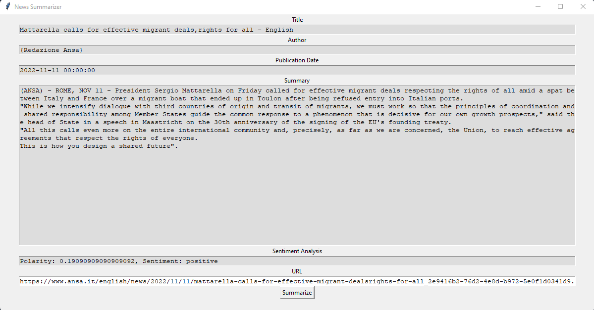

    

The text summarizer is a project in which we make a deep neural network using natural language processing. The idea is to take some paragraphs of text and build their summary. It is very helpful to get a summary of the article.

